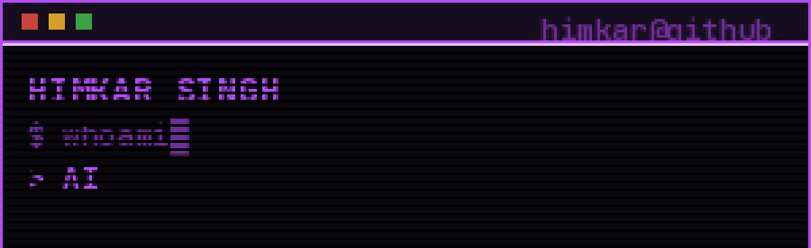

<div align="center">



<br/>


<br/>


<br/><br/>

[](https://linkedin.com/in/himkarsingh)
[](https://x.com/himkarsingh99)
[](https://discord.gg/zhBCdUvKrS)
[](https://instagram.com/himkarsingh99)

```
░▒▓█████████████████████████████████████▓▒░
```

</div>
